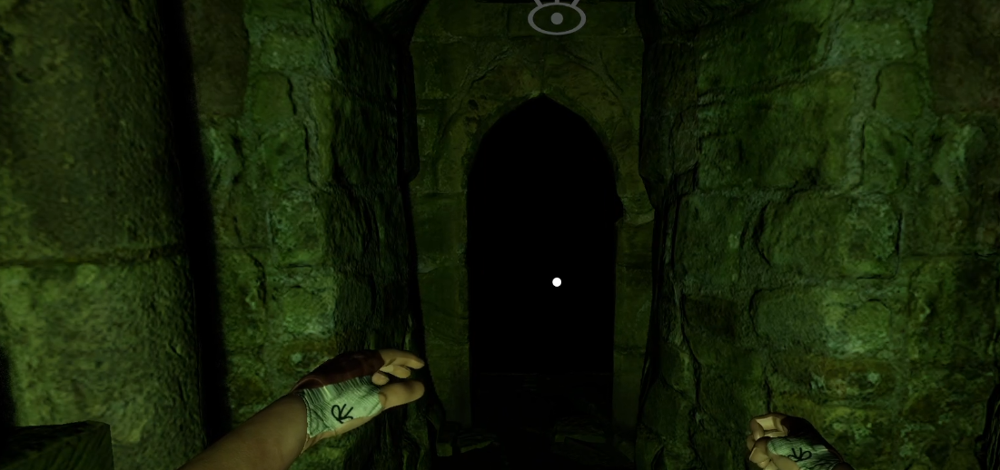
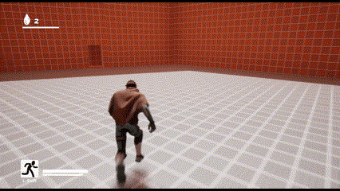
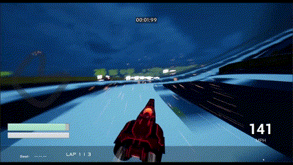

# Andrew Walthall
# Game Designer
(850) 529-9701 
andrew.walthall@me.com 

## Projects
### Midnight Wave
Kickstarter, Action Combat Demo

### Monster Eater
Full Sail Runway

### Sunlit

### Up To Speed

#### Skills: 
- Game Engines: Unreal Engine 4, Unreal Engine 5, Unity, Game Maker
- Languages: C++, Java, Typescript, Blueprint
- Software: Atlassian, Jira, Confluence, Trello, Bitbucket, Git, Github, Gitlab, Jetbrains, Rider, CLion, VS Code, Visual Studio, Digital Ocean, GSuite, Click Up, Office
- System design, movement mechanics, combat mechanics, level design 

## Education        		
- B.S., Game Design | Full Sail University (_May 2022_)
- B.S., Computer Science | University of West Florida (_In Progress_)

## Professional Experience
**Project Runway (June 2024 - August 2024)**
- HUD Design
- Level Design
- Programming
