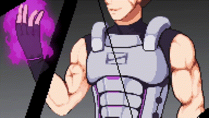

# Andrew Walthall
# Game Designer
(850) 529-9701

andrew.walthall@me.com 

## Projects
This portfolio is a WIP!

### Midnight Wave
Kickstarter, Action Combat Demo

[Midnight Wave Kickstarter](https://www.kickstarter.com/projects/andrewwalthall/midnight-wave-cyberpunk-samurai-tactical-platform?ref=user_menu)

[Midnight Wave Character Creator](https://andrew-double-u.itch.io/midnight-wave-character-creator)

TODO: Create a button that links to a project breakdown.

### Monster Eater
Full Sail Runway

 

TODO: Create a button that links to a project breakdown.

### Sunlit

TODO: Create a button that links to a project breakdown.

### Up To Speed

TODO: Create a button that links to a project breakdown.

### WIP
TODO: Add all my other projects.

#### Skills: 
- Game Engines: Unreal Engine 4, Unreal Engine 5, Unity, Game Maker
- Languages: C++, Java, Typescript, Blueprint
- Software: Atlassian, Jira, Confluence, Trello, Bitbucket, Git, Github, Gitlab, Jetbrains, Rider, CLion, VS Code, Visual Studio, Digital Ocean, GSuite, Click Up, Office
- System design, movement mechanics, combat mechanics, level design 

## Education        		
- B.S., Game Design | Full Sail University (_May 2022_)
- B.S., Computer Science | University of West Florida (_In Progress_)

## TODO: Resume, experience, etc.
